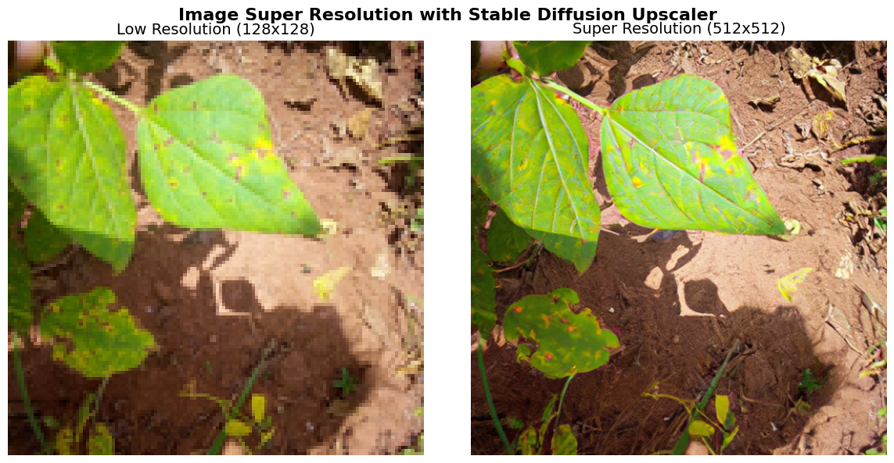

# 🖼️ Image Super Resolution with HuggingFace Diffusers

A hands-on tutorial demonstrating image super resolution using 
the `stabilityai/stable-diffusion-x4-upscaler` model.

## Results

## What this covers
- Loading a diffusion-based SR pipeline from HuggingFace
- Text-guided upscaling (4x resolution enhancement)
- Visual comparison of LR vs SR output

## How to run
Click the badge below to open in Google Colab:

